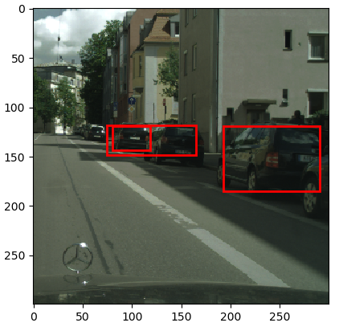
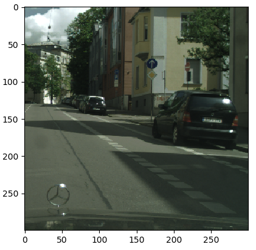
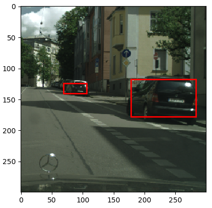

# Vehicle Detection

This project uses Single Shot MultiBox Detector([SSD](https://arxiv.org/abs/1512.02325)) to detect vehicle and humans from urban street scenes.

## Prerequisites
* Python: 3.5, 3.6
* torch: 0.4.1
* torchvision: 0.2.1
* numpy
* matplotlib

## Dataset
* images and annotations: [Cityscapes Dataset](https://www.cityscapes-dataset.com/)

## Results

* Sample images and predict results   

  
 
  

## Acknowledgment
* The project is developed based on skeleton code from TA of SFU CMPT742.
* It uses [MobileNetV2](https://arxiv.org/abs/1801.04381) as base net.













